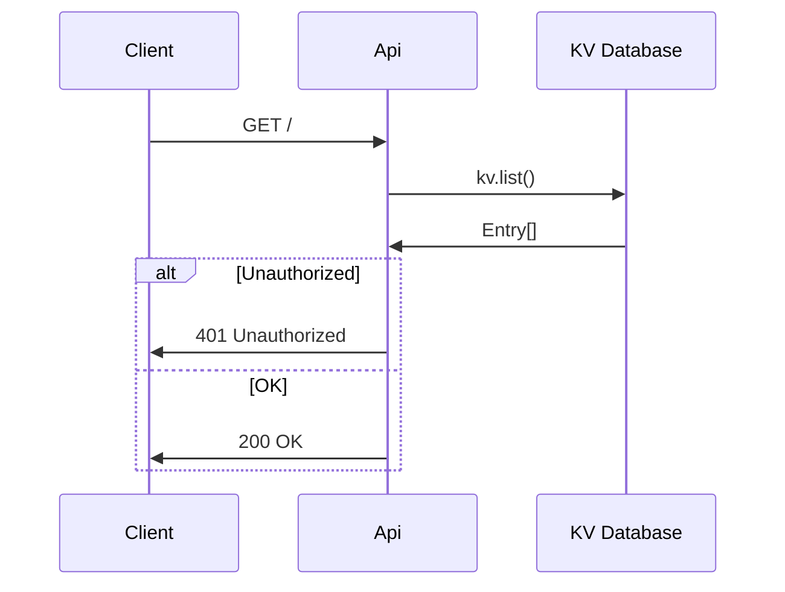
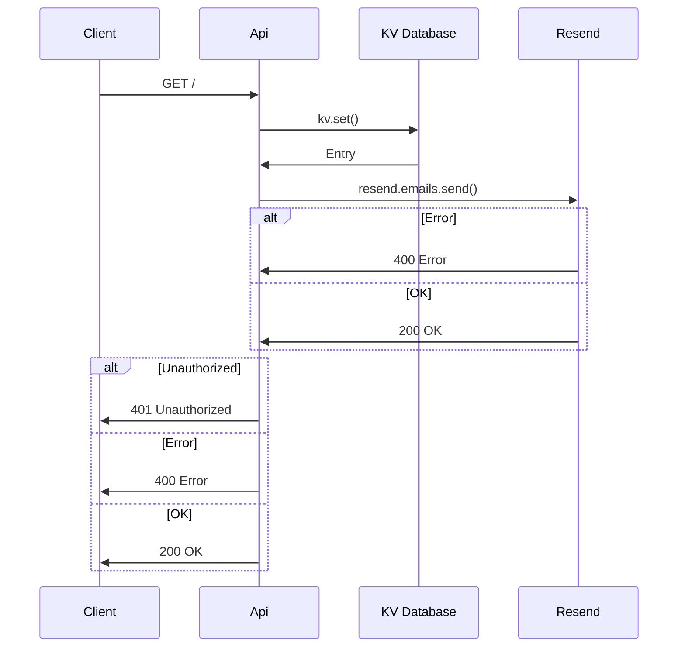
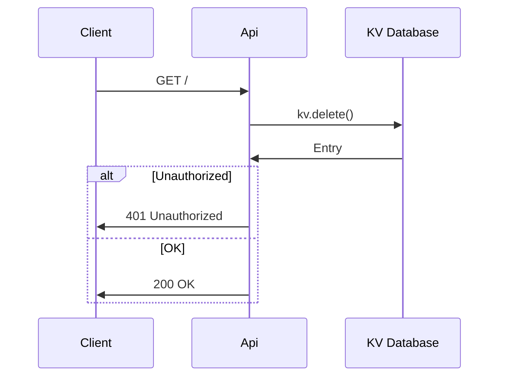

# Tickets API

Simple API to manage tickets hosted on Deno deploy.

## Local developement

Local developement requires a few env variables:

- `API_KEY` - Arbitrary string value, that needs to match `Authorization` bearer
- `API_KEY_RESEND` - Ask Pawel, we will be happy to give it to contributors

```
API_KEY=XXX API_KEY_RESEND=XXX deno run --unstable-kv --allow-env --allow-net index.ts
```

## Endpoints

### GET /

```
curl --request GET \
  --url http://localhost:8000/ \
  --header 'Authorization: Bearer XXX'
```



### POST /

```
curl --request POST \
  --url http://localhost:8000/ \
  --header 'Authorization: Bearer XXX' \
  --header 'Content-Type: application/json' \
  --data '{
	"name": "Pablo Picasso",
	"email": "pablo@picasso.com"
}'
```



### DELETE /

```
curl --request DELETE \
  --url http://localhost:8000/ \
  --header 'Authorization: Bearer XXX' \
  --header 'Content-Type: application/json' \
  --data '{
	"id": "XXX"
}'
```


