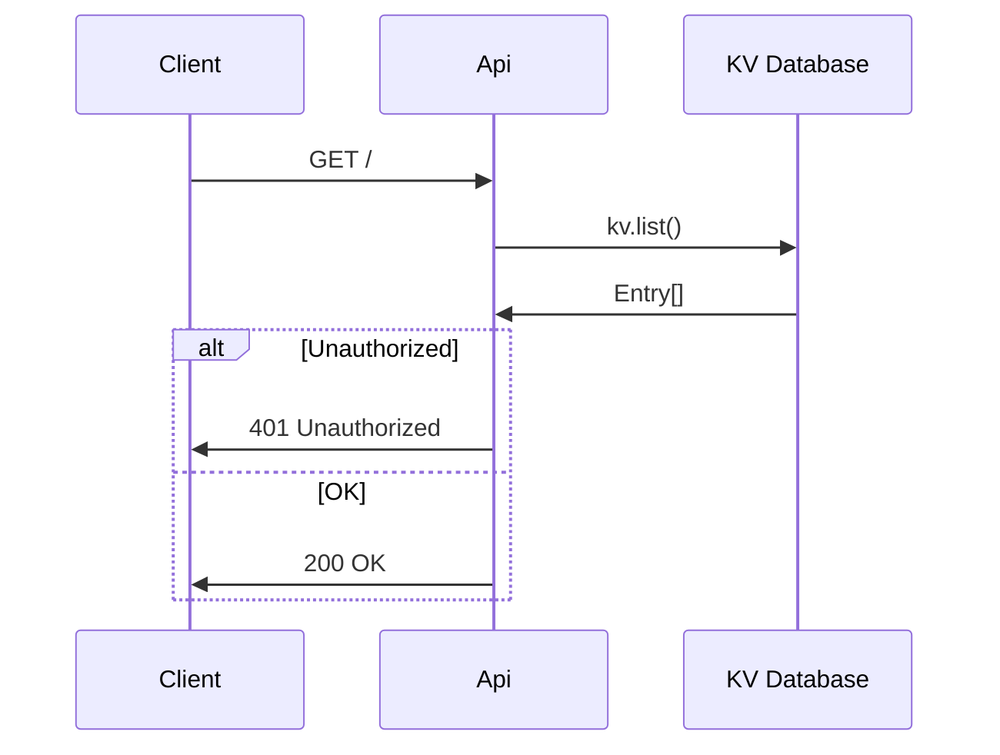
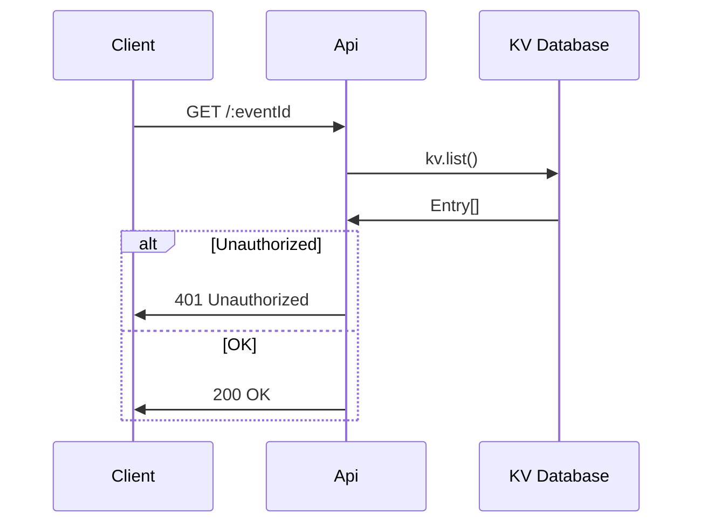
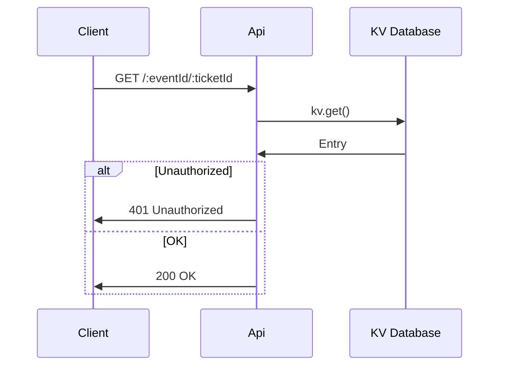
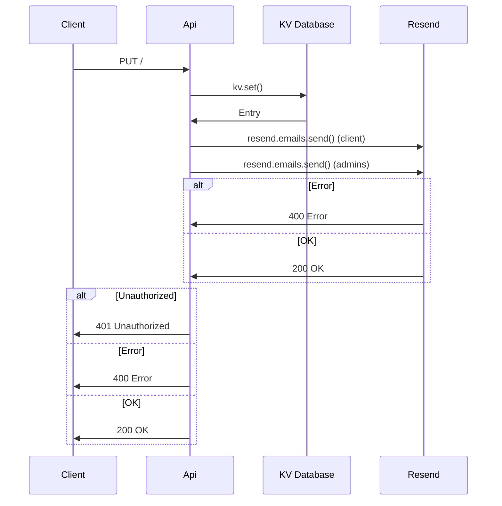
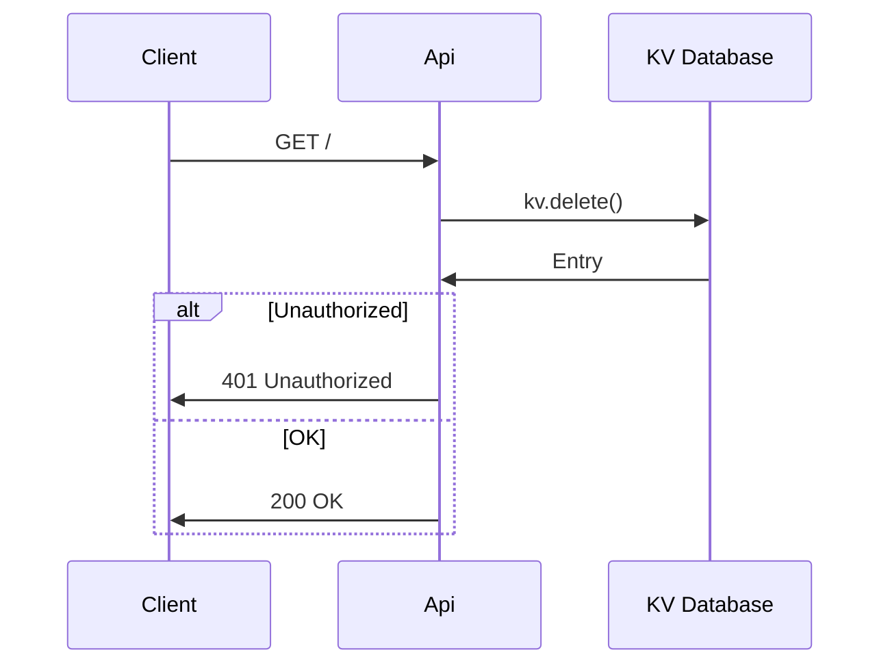

# Tickets API

Simple API to manage tickets hosted on Deno deploy.

## Local developement

Local developement requires a few env variables:

- `API_KEY` - Arbitrary string value, that needs to match `Authorization` bearer
- `API_KEY_RESEND` - Ask Pawel, we will be happy to give it to contributors
- `ADMIN_RECIPIENTS` - Comma-separated admin emails

```
API_KEY=XXX API_KEY_RESEND=XXX ADMIN_RECIPIENTS=XXX deno run --unstable-kv --allow-env --allow-net index.ts
```

## Endpoints

### GET /

```
curl --request GET \
  --url http://localhost:8000/ \
  --header 'Authorization: Bearer XXX'
```



### GET /:eventId

```
curl --request GET \
  --url http://localhost:8000/:eventId \
  --header 'Authorization: Bearer XXX'
```



### GET /:eventId/:ticketId

```
curl --request GET \
  --url http://localhost:8000/:eventId/:ticketId \
  --header 'Authorization: Bearer XXX'
```



### POST /

```
curl --request POST \
  --url http://localhost:8000/ \
  --header 'Authorization: Bearer XXX' \
  --header 'Content-Type: application/json' \
  --data '{
	"name": "Pablo Picasso",
	"email": "pablo@picasso.com",
	"eventName": "#2: \"Design Secrets for Developers\" by Thomas Reeve and \"Type-safe localization of Unsplash.com\" by Oliver Ash",
	"eventDate": "Thursday, 27/06/2024, 18:00",
	"eventLocation": "Vulcan Works, 34-38 Guildhall Rd, Northampton, NN1 1EW"
}'
```


### PUT /

```
curl --request PUT \
  --url http://localhost:8000/ \
  --header 'Authorization: Bearer XXX' \
  --header 'Content-Type: application/json' \
  --data '{
	"ticketId": "123",
	"ticketToken": "123",
	"eventId": 123,
	"eventName": "#2: \"Design Secrets for Developers\" by Thomas Reeve and \"Type-safe localization of Unsplash.com\" by Oliver Ash",
	"eventDate": "Thursday, 27/06/2024, 18:00",
	"eventLocation": "Vulcan Works, 34-38 Guildhall Rd, Northampton, NN1 1EW"
}'
```



### DELETE /:eventId/:ticketId

```
curl --request DELETE \
  --url http://localhost:8000/:eventId/:ticketId \
  --header 'Authorization: Bearer XXX' \
```


